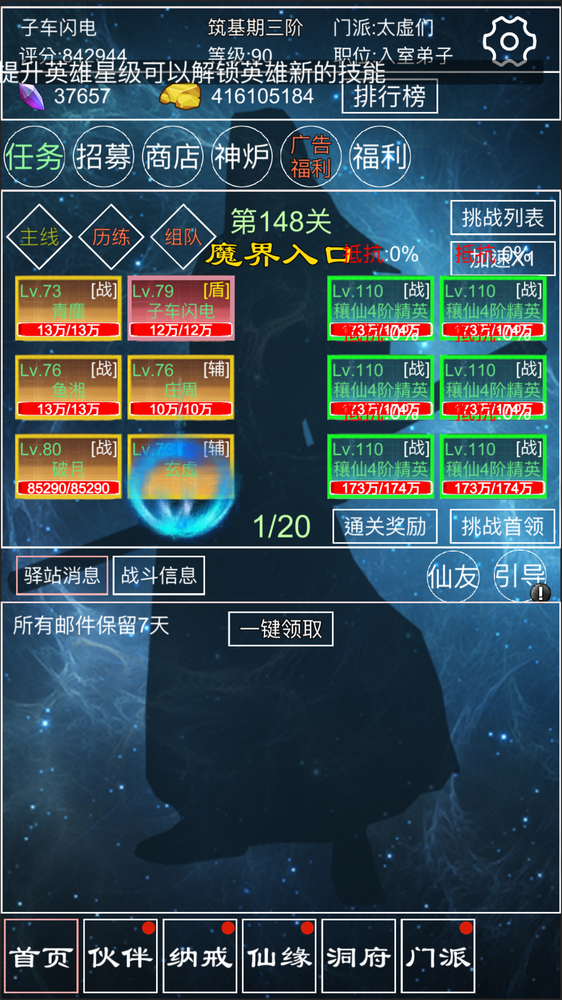

独立游戏，基于利益冲突原则，作品已下架

| 截图 | 截图 | 截图 | 截图 | 截图 | 截图 |
| --- | - | --- | --- | - | --- |
|  |  |  |  |  |  

该作品是一款2D文字放置类游戏，参考过多款不同类型的放置类、rougolike类游戏。
| 分类 | 方案 | 细节 |
| --- | - | --- |
| 策划 | - | --- |
|  | 世界观 | 游戏世界观及人设的设计，台词、背景、关系等 |
|  | 挂机养成 | --- |
|  | 抽卡养成 | --- |
|  | 装备养成 | --- |
|  | 组队竞技 | --- |
|  | 数值平衡设计 | --- |
| 客户端 | - | --- |
|  | C#热更新 | --- |
|  | 资源热更新 | --- |
|  | Mono重编译 | --- |
|  | 独立GamePlay库 | 可以独立运行在unity和服务器net框架下的战斗框架 |
|  | 安全 | 反破解、加密、校验等 |
| 服务器 | - | --- |
|  | 云服务器部署 | --- |
|  | JavaSpring框架开发 | --- |
|  | 数据库设计 | --- |
|  | 分布式设计 | --- |
|  | 跨服玩法 | --- |
|  | GM后台设计 | --- |

