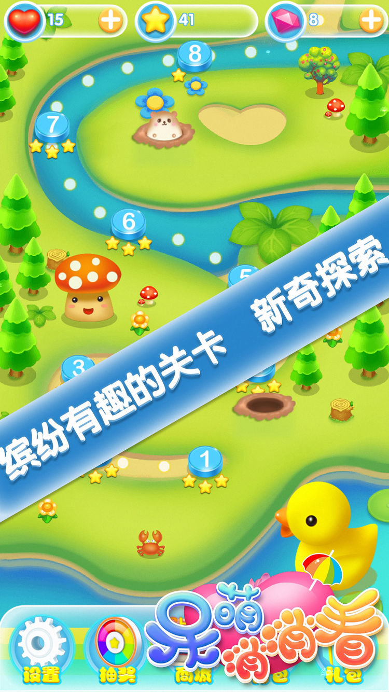

独立游戏，基于利益冲突原则，作品已下架,<a href="https://github.com/zwluoqi/sanxiao">项目已开源</a>

| 截图 | 截图 | 截图 | 截图 | 截图 | 截图 |
| --- | - | --- | --- | - | --- |
|  |  |  |  |  |  

该作品是一款三消+RPG元素游戏，
| 分类 | 方案 | 细节 |
| --- | - | --- |
| 美术 | - | --- |
|  | 清新可爱风 |  |
| 客户端 | - | --- |
|  | 关卡编辑 | 独立的关卡编辑器，可以设计基础的关卡base信息 |
|  | 手感流畅性 | |
|  | 动画流畅性 | |
