# Qingzhu_Game_Collection
 本人参与过的一些商业游戏、独立游戏、技术项目的截图和业务简述

| 游戏 | 截图 | 截图 | 截图 | 截图 |截图 |
| - | - | --- | --- | - |- |
| 商业游戏 |  
|<a href="https://github.com/zwluoqi/Qingzhu_Game_Collection/tree/main/Business_Game_Collection/苍蓝誓约">苍蓝誓约</a> |2017-2020| 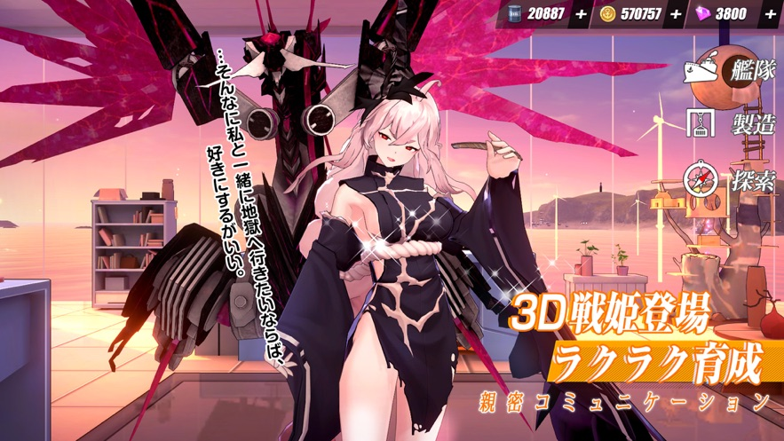 | 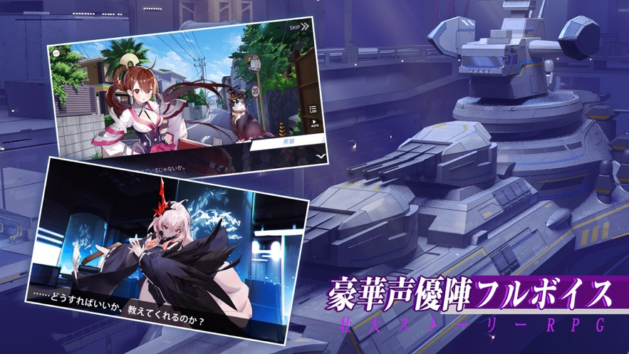 | 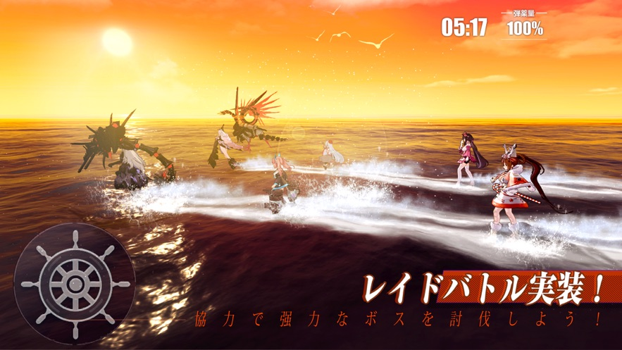 |  |
|<a href="https://github.com/zwluoqi/Qingzhu_Game_Collection/tree/main/Business_Game_Collection/不良人2">不良人2</a>|2016-2016| |  |  |  |
|<a href="https://github.com/zwluoqi/Qingzhu_Game_Collection/tree/main/Business_Game_Collection/刀剑神域">刀剑神域</a>|2015-2016|  | 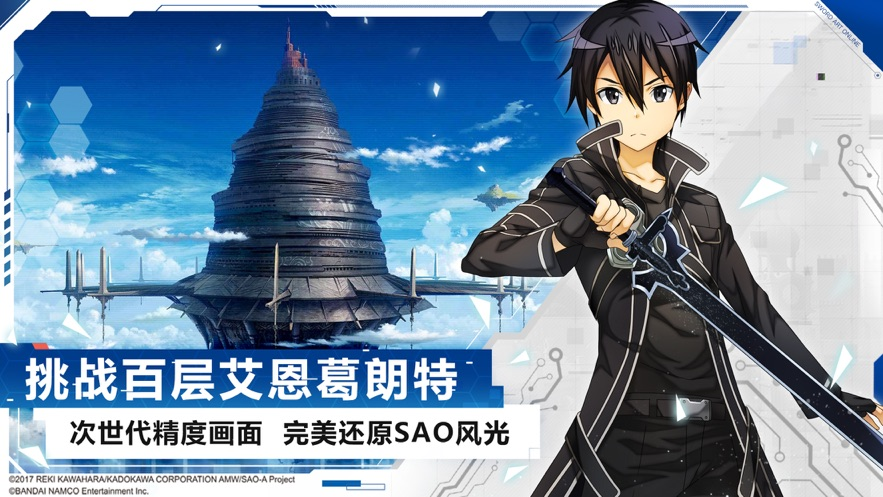 | 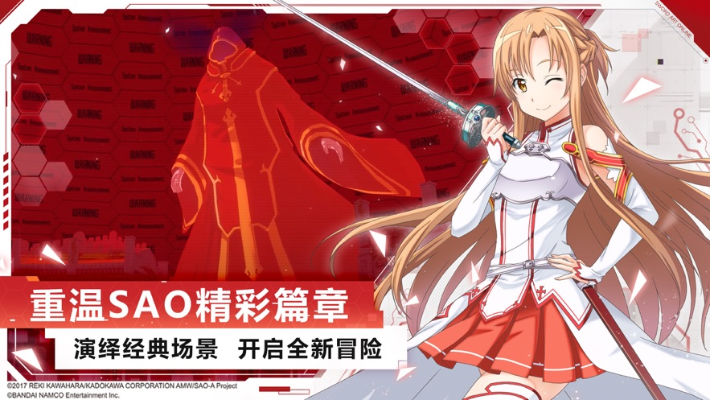 | 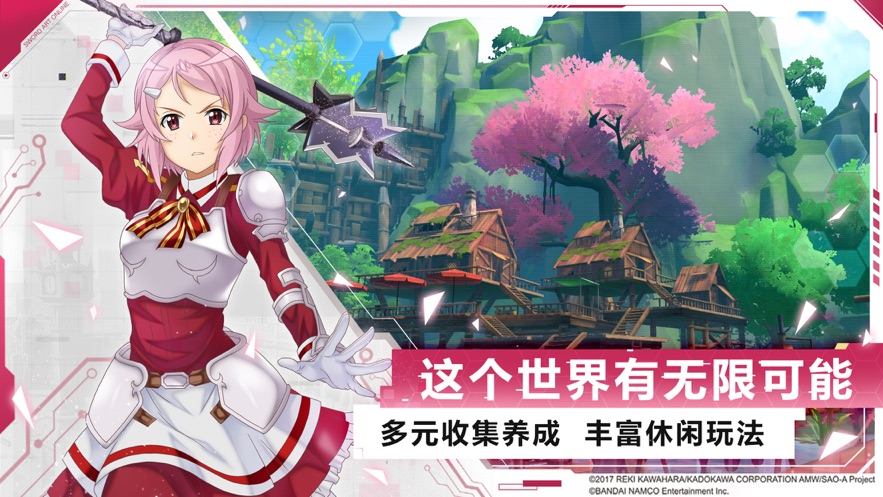 |
| 独立游戏 |  
|<a href="https://github.com/zwluoqi/Qingzhu_Game_Collection/tree/main/Independent_Game_Collection/装备合成器">装备合成器</a>|<a href="https://github.com/zwluoqi/TextEquip">已经开源</a>|  |  | 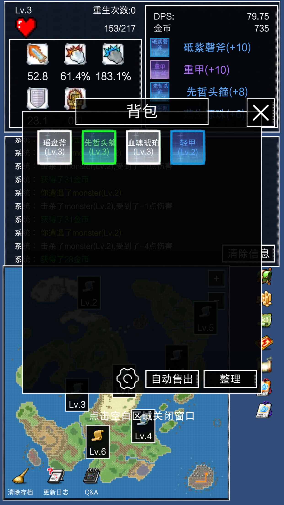 | 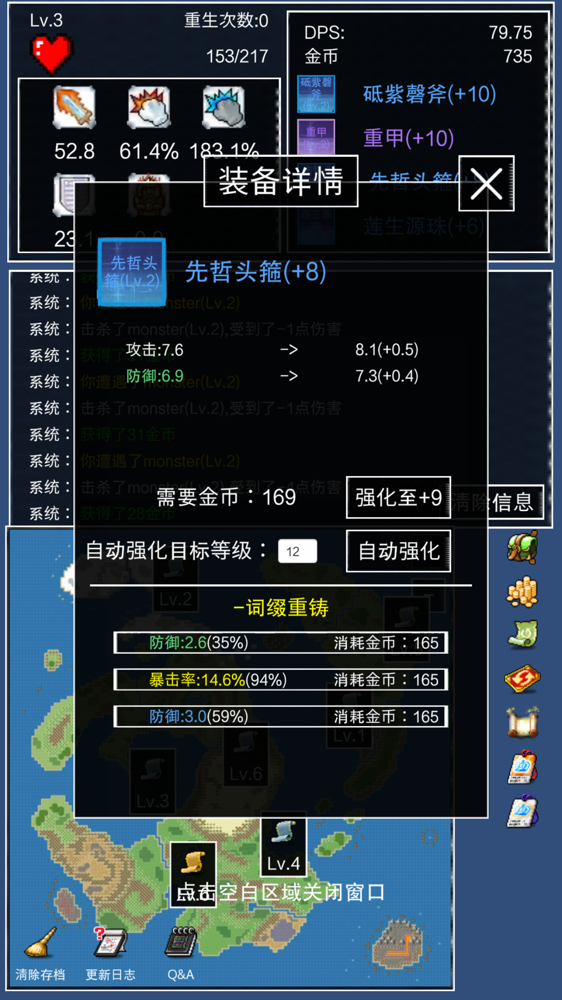 | 
|<a href="https://github.com/zwluoqi/Qingzhu_Game_Collection/tree/main/Independent_Game_Collection/剑破仙界">剑破仙界</a>|暂未项目| 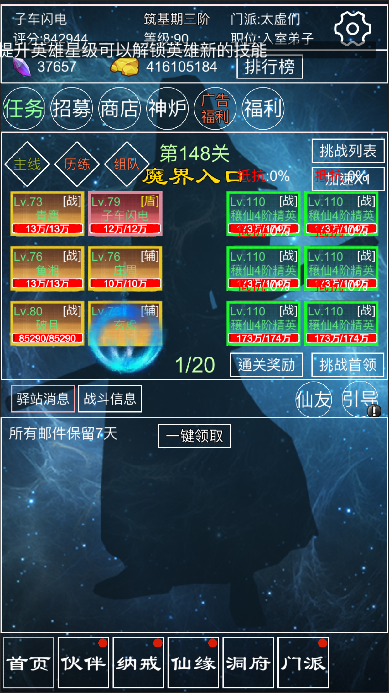 | 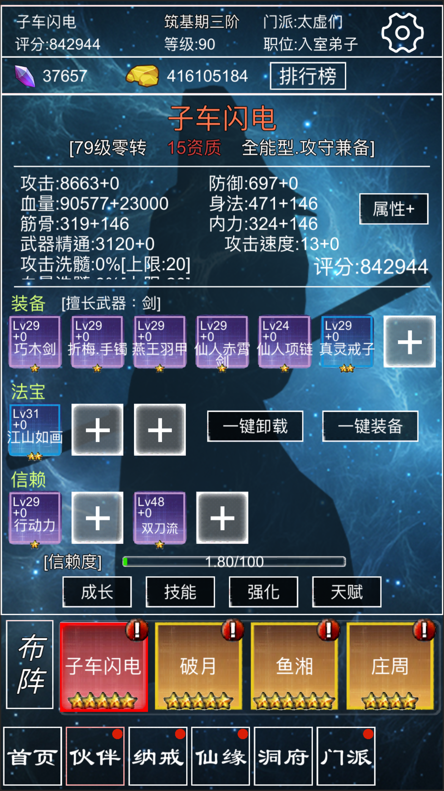 | 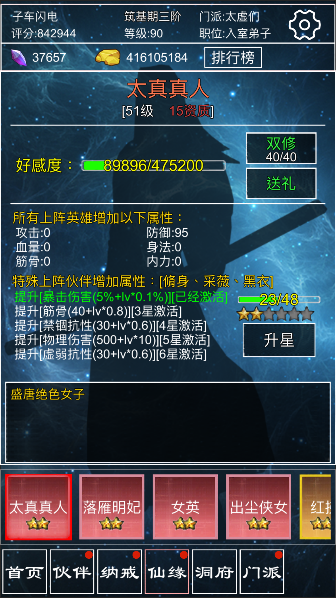 | 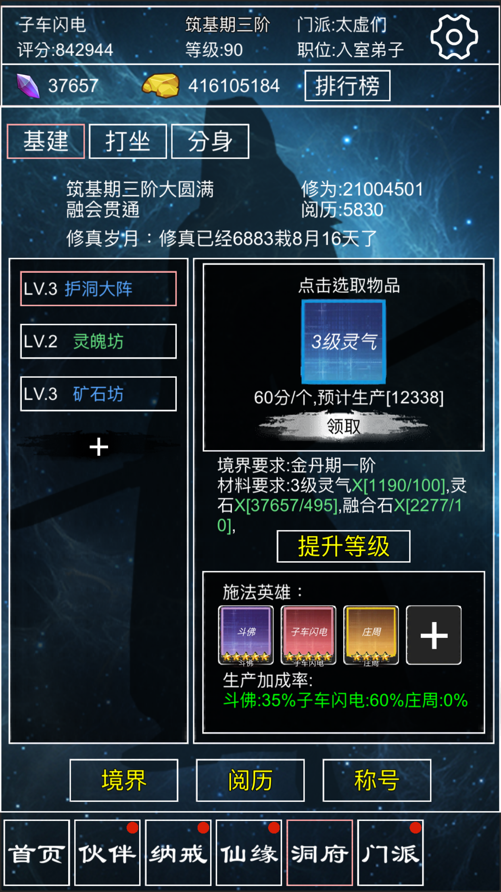 | 
|<a href="https://github.com/zwluoqi/Qingzhu_Game_Collection/tree/main/Independent_Game_Collection/修仙破尘录">修仙破尘录</a>|暂未开源| 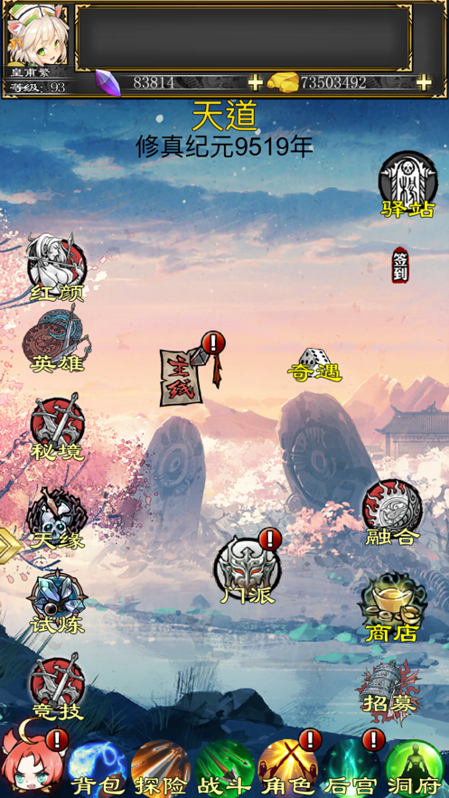 | 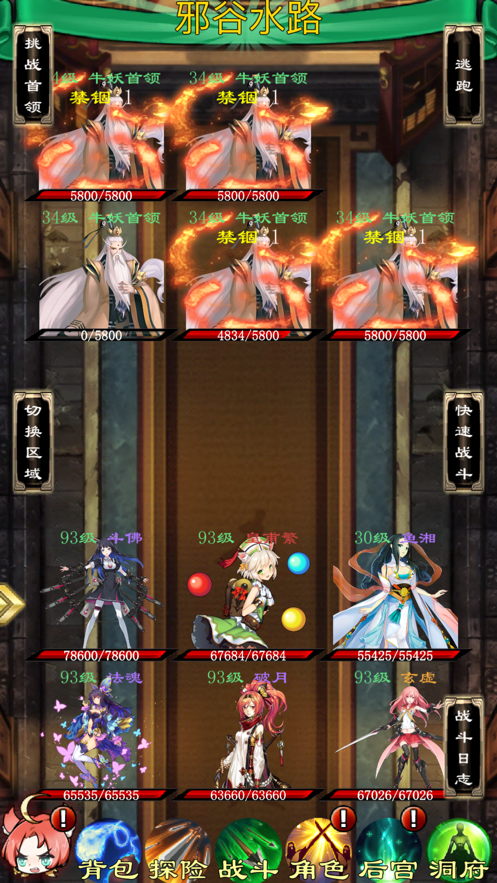 | 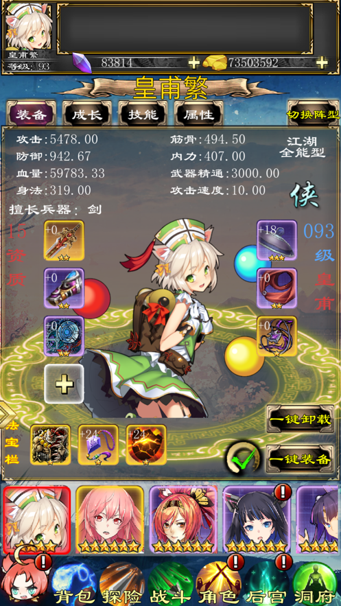 |  |
|<a href="https://github.com/zwluoqi/Qingzhu_Game_Collection/tree/main/Independent_Game_Collection/宠物小精灵">宠物小精灵</a>|<a href="https://github.com/zwluoqi/RoundRpg">已经开源</a>| 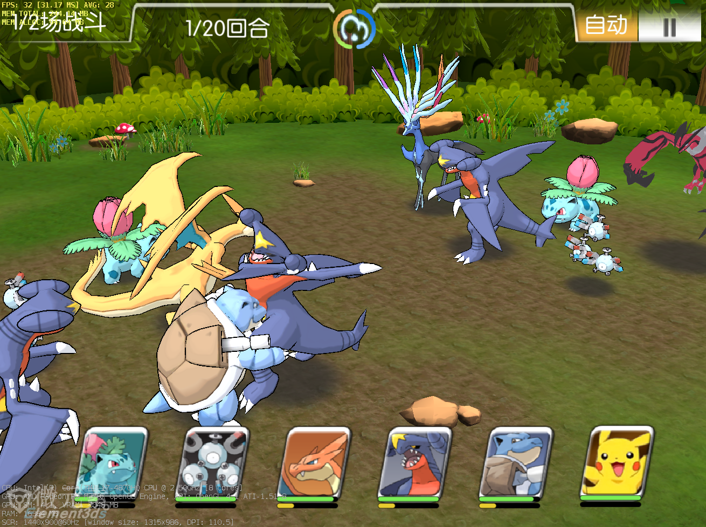 | 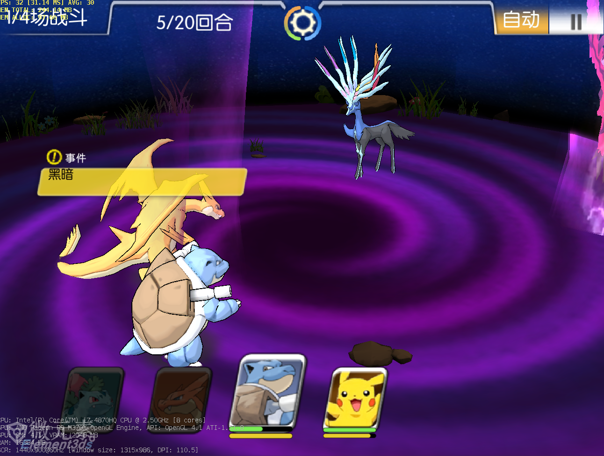 |||
|<a href="https://github.com/zwluoqi/Qingzhu_Game_Collection/tree/main/Independent_Game_Collection/呆萌消消看">呆萌消消看</a>|<a href="https://github.com/zwluoqi/sanxiao">已经开源</a>|  | 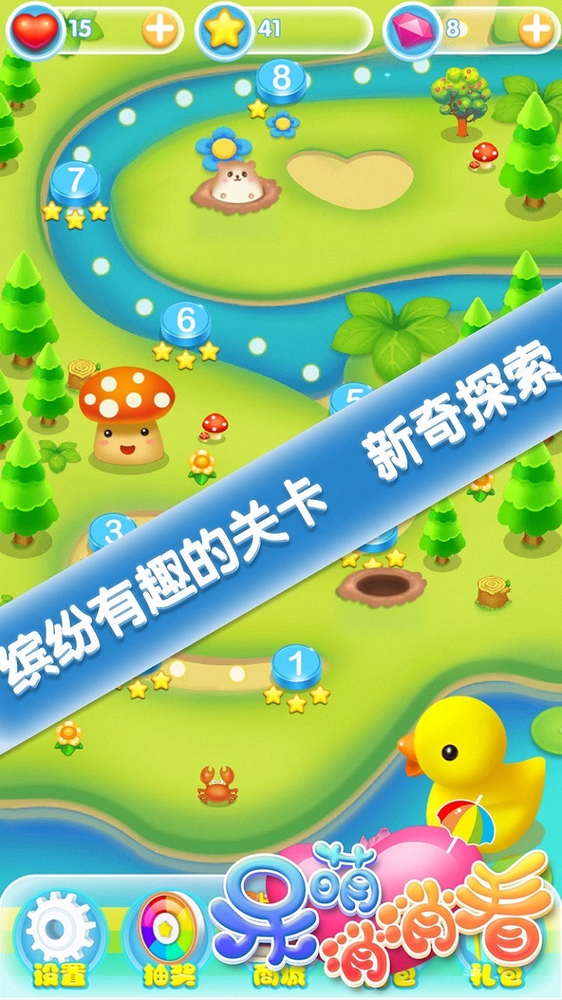 |  | | 
| 技术项目 | 
|<a href="mobile-visual-shader-editor">VisualShaderGraph</a>|开源项目|一款跨平台着色器编辑工具|基于BGFX渲染器|
|<a href="URP_Collection_Tech">URP_Collection_Tech</a>|开源项目|一些URP实践用例|GPU Driver、Jobsystem、ComputerShader、全局光照等|

