# Qingzhu_Game_Collection
 本人参与过的一些商业游戏、独立游戏、技术项目的截图和业务简述

| 游戏 | 截图 | 截图 | 截图 | 截图 |截图 |
| - | - | --- | --- | - |- |
| 商业游戏 |  
|<a href="https://github.com/zwluoqi/Qingzhu_Game_Collection/tree/main/Business_Game_Collection/苍蓝誓约">苍蓝誓约</a> |战舰二次元卡牌| 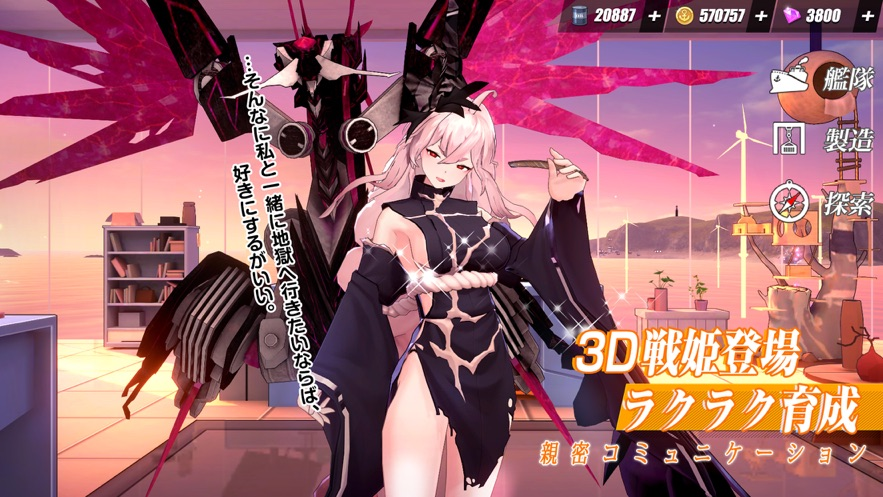 | 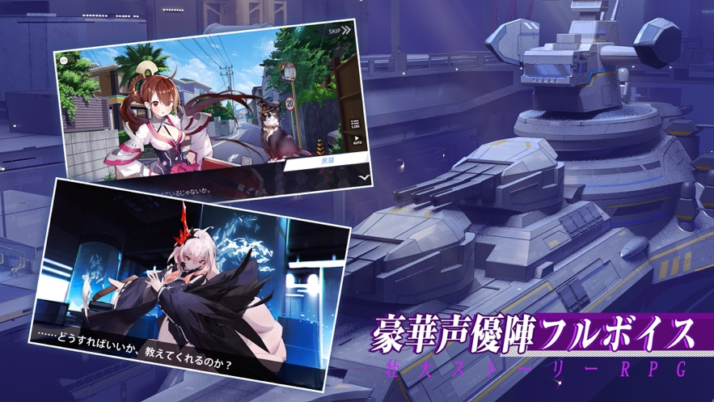 | 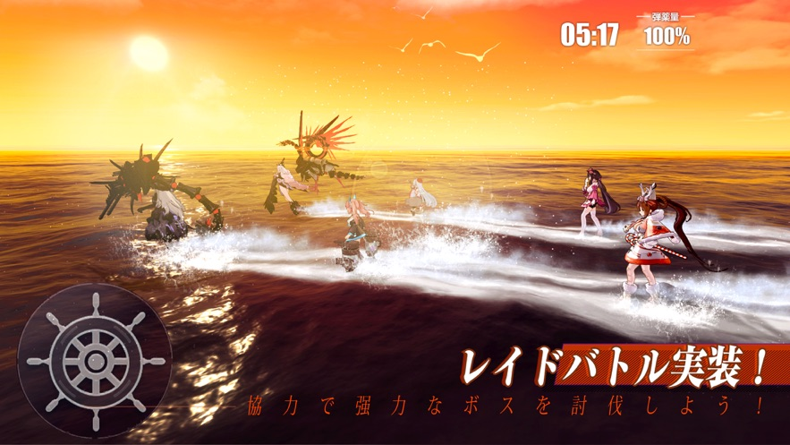 |  |
|<a href="https://github.com/zwluoqi/Qingzhu_Game_Collection/tree/main/Business_Game_Collection/不良人2">不良人2</a>|MMO国战|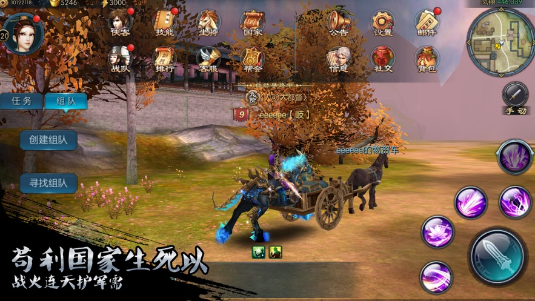 | 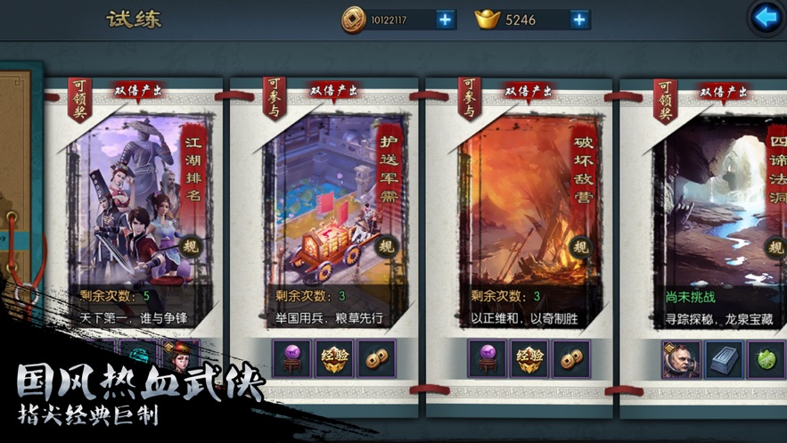 | 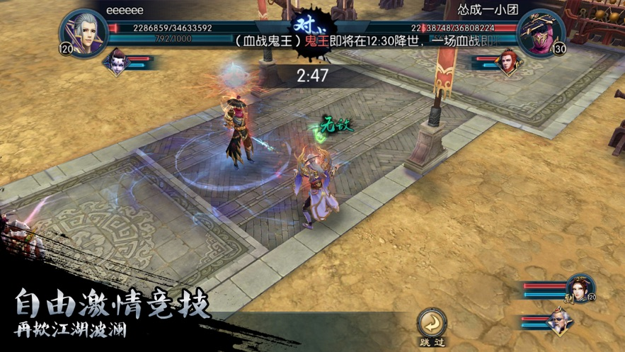 | 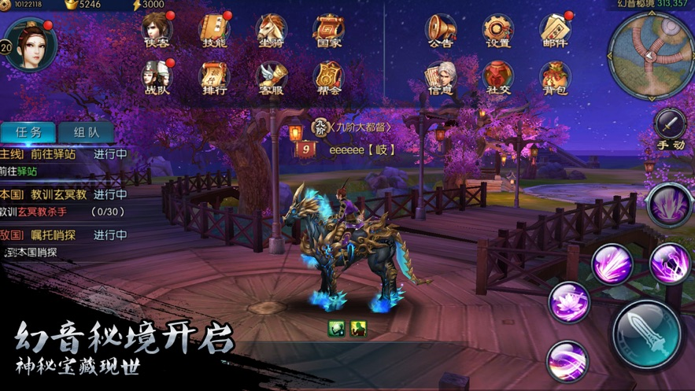 |
|<a href="https://github.com/zwluoqi/Qingzhu_Game_Collection/tree/main/Business_Game_Collection/刀剑神域">刀剑神域</a>|回合二次元卡牌| 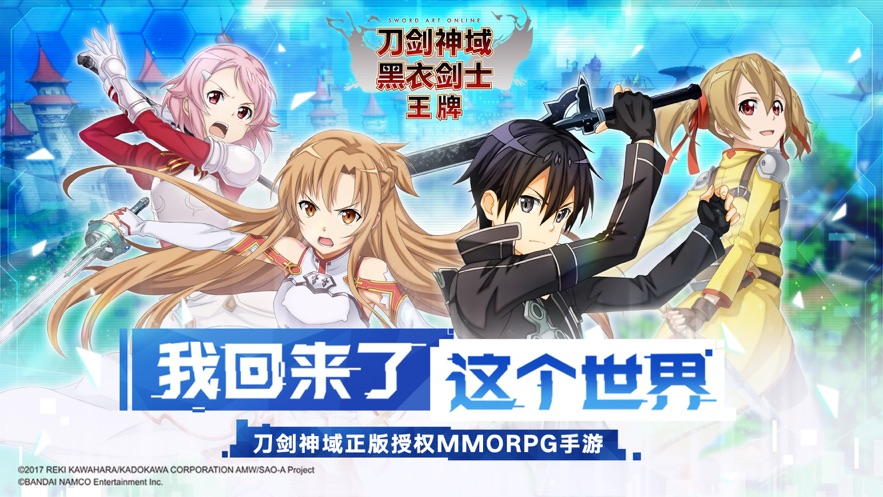 | 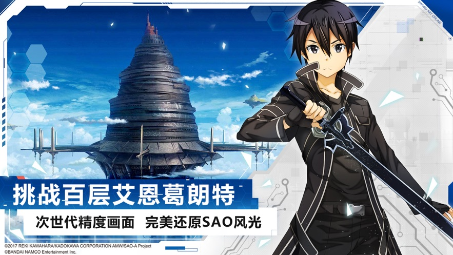 | 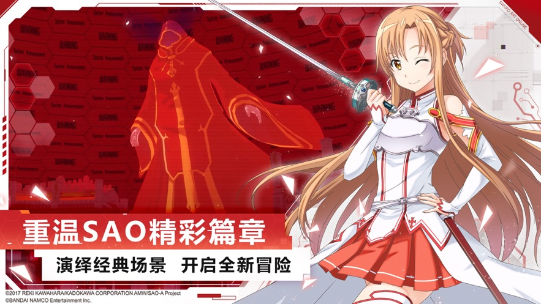 |  |
| 独立游戏 |  
|<a href="https://github.com/zwluoqi/Qingzhu_Game_Collection/tree/main/Independent_Game_Collection/装备合成器">装备合成器</a>|<a href="https://github.com/zwluoqi/TextEquip">已经开源</a>| 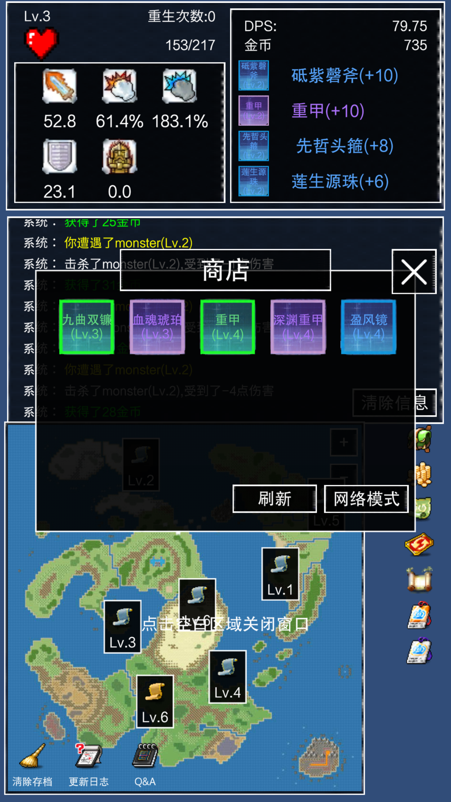 | 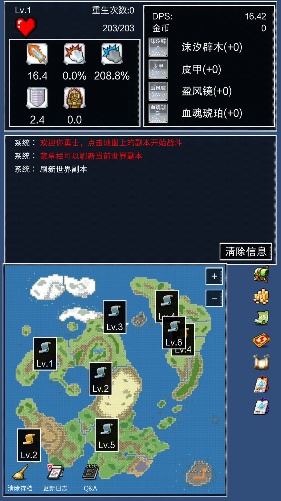 |  |  | 
|<a href="https://github.com/zwluoqi/Qingzhu_Game_Collection/tree/main/Independent_Game_Collection/剑破仙界">剑破仙界</a>|暂未开源| 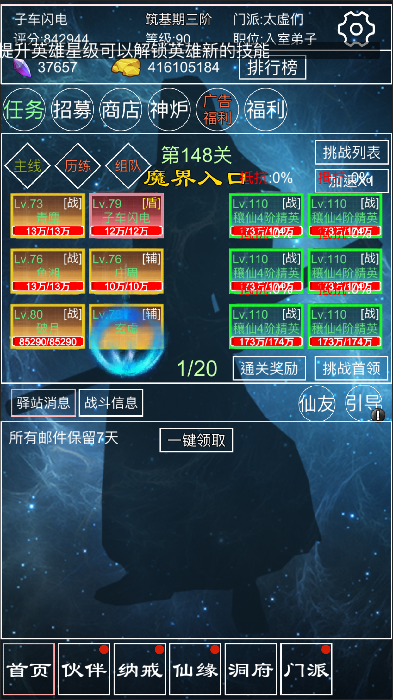 | 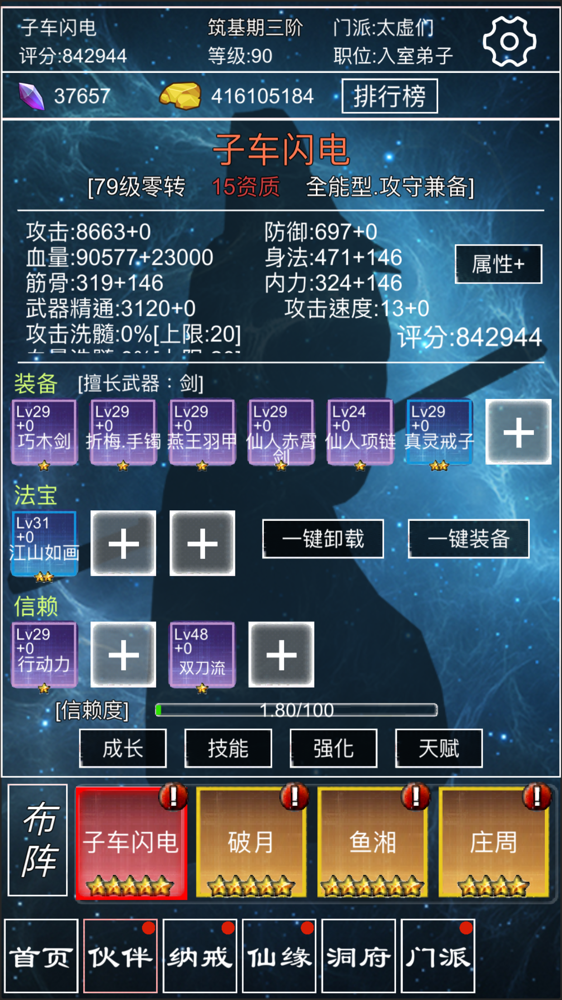 | 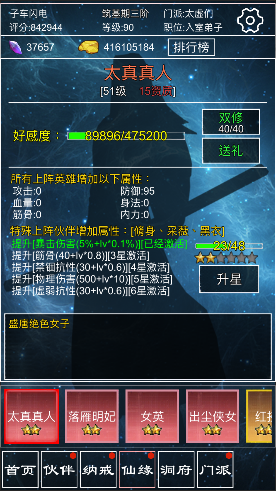 | 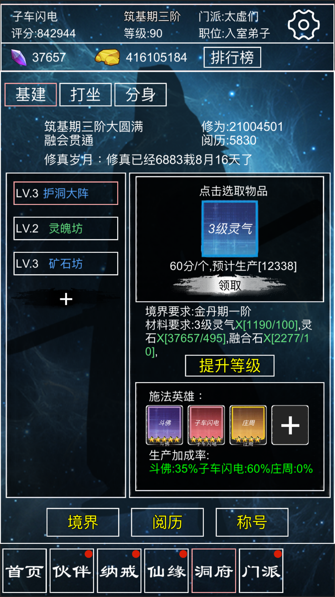 | 
|<a href="https://github.com/zwluoqi/Qingzhu_Game_Collection/tree/main/Independent_Game_Collection/宠物小精灵">宠物小精灵</a>|<a href="https://github.com/zwluoqi/RoundRpg">已经开源</a>|  |  |||
|<a href="https://github.com/zwluoqi/Qingzhu_Game_Collection/tree/main/Independent_Game_Collection/呆萌消消看">呆萌消消看</a>|<a href="https://github.com/zwluoqi/sanxiao">已经开源</a>|  |  |  | 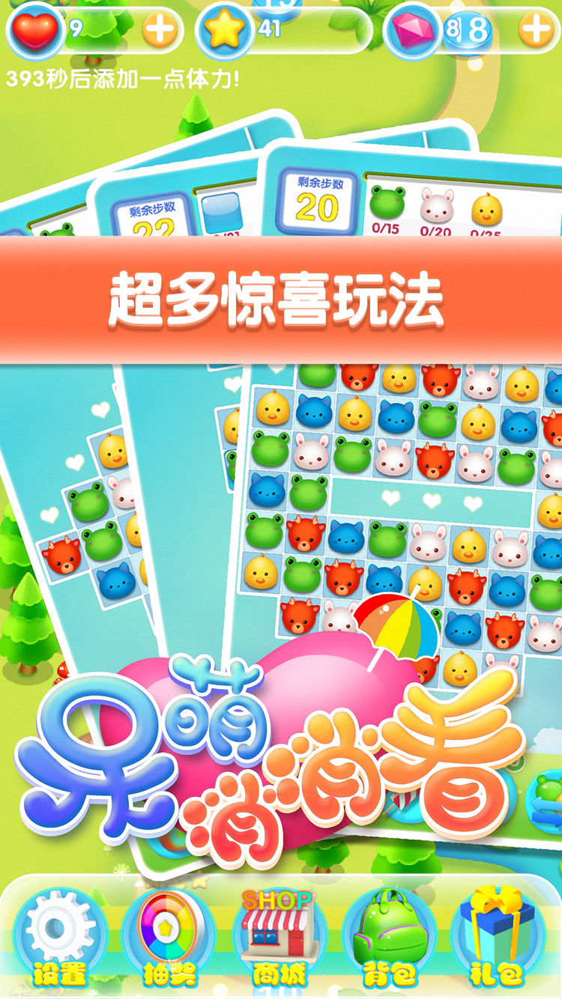| 
| 技术项目 | 
|<a href="https://github.com/zwluoqi/mobile-visual-shader-editor/wiki/Visual-Shader">VisualShaderGraph</a>|<a href="https://github.com/zwluoqi/mobile-visual-shader-editor">开源项目</a>|一款跨平台着色器编辑工具||
|URP_Collection_Tech|<a href="https://github.com/zwluoqi/URP_Collection_Tech">开源项目</a>|一些URP实践用例||
|Shader_For_Beginer|<a href="https://github.com/zwluoqi/Shader_For_Beginer">开源项目</a>|后处理Shader技术栈||
|Galaxy PCG|<a href="https://github.com/zwluoqi/Galaxy_PCG">开源项目</a>|PCG技术栈|  ||
|L-System|<a href="https://github.com/zwluoqi/LSystems">开源项目</a>| <a href="https://www.bilibili.com/video/BV1P54y1Z7bE">Unity版本L-Systems完整实现,PCG植被解决方案</a> |  | |
|MarchingCube PCG|<a href="https://github.com/zwluoqi/MarchingCube">开源项目</a>| <a href="https://www.bilibili.com/video/bv1ou411z72k">MarchingCube无限地形解决方案</a>  |  |  |
|Sky Atomspheric And Cloud|<a href="https://github.com/zwluoqi/Clouds">开源项目</a>| <a href="https://www.bilibili.com/video/BV1UY411M7DR/">RayMarchd大气天空和云解决方案</a>  |  |  |

